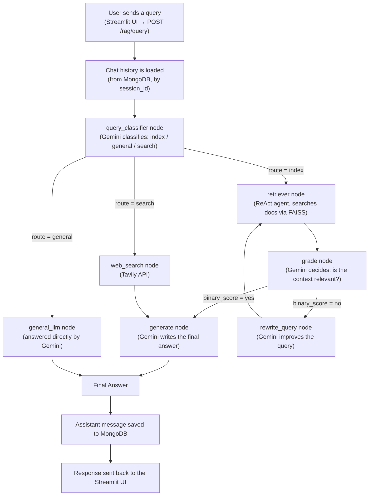
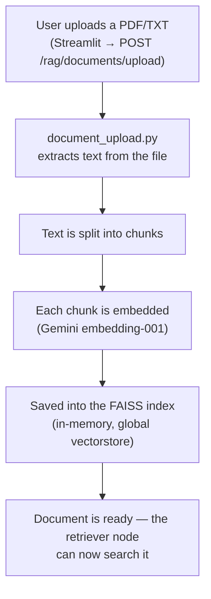
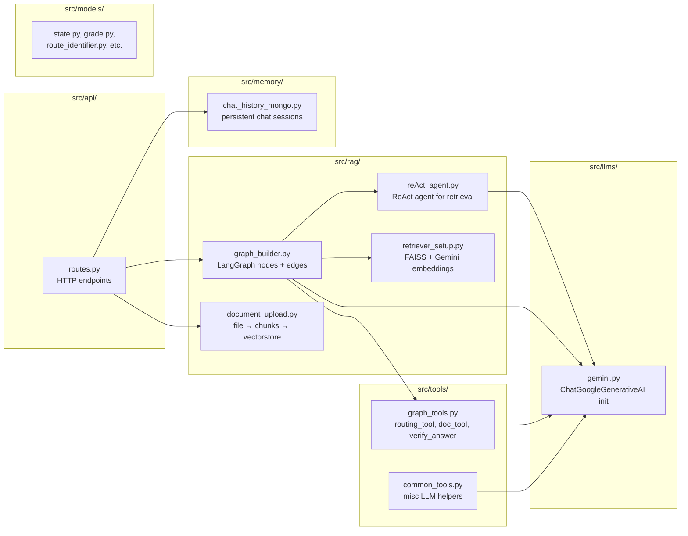

# 🔄 IntelliQuery — Architecture & Flow (Explained)

> This document explains how IntelliQuery is designed, which LLM/embedding stack it uses,
> and walks through the complete flow of the system (from an incoming query to the final
> answer) with diagrams.

---

## 1. What Is This Project, In One Line?

IntelliQuery is an **agentic RAG system** built with **Google Gemini** as its LLM and
embedding backbone. It implements the **Adaptive RAG** pattern — it adaptively routes
every incoming query based on its type (answering from your uploaded documents, from the
LLM's general knowledge, or from real-time web search), instead of always using a single
fixed retrieval path. The entire orchestration runs as a state machine (graph) built with
**LangGraph**.

> **Concept:** Adaptive RAG — query classification + conditional routing + relevance
> grading + a self-correcting retrieval loop (rewrite the query and re-retrieve if the
> retrieved context isn't relevant).

---

## 2. LLM & Embedding Stack

| Component | Technology | Purpose |
|---|---|---|
| Chat LLM | **Google Gemini** (`gemini-2.5-flash`, via `ChatGoogleGenerativeAI`) | Query classification, relevance grading, query rewriting, answer generation, and the ReAct retrieval agent all use this single `llm` object |
| Embeddings | **Google Gemini Embeddings** (`gemini-embedding-001`, via `GoogleGenerativeAIEmbeddings`) | Converts document chunks into vectors for similarity search |
| Vector Store | **FAISS** | In-memory similarity search index for uploaded documents |
| Web Search | **Tavily API** | Real-time web search for queries that need current information |
| Chat Memory | **MongoDB** | Persists per-session chat history |

Both the LLM and embeddings are initialized in one place each:
- `src/llms/gemini.py` — initializes the chat LLM, imported everywhere as `llm`
- `src/rag/retriever_setup.py` — initializes the embeddings and builds the FAISS retriever

### `.env` configuration

```env
GEMINI_API_KEY=your_gemini_api_key_here
GEMINI_CHAT_MODEL=gemini-2.5-flash   # optional, this is already the default
TAVILY_API_KEY=your_tavily_api_key_here
```

You can get a Gemini API key here: https://aistudio.google.com/apikey

---

## 3. High-Level Flow Diagram (Query → Answer)



**The most important thing to notice:** Gemini is called in **5 distinct places** in this
graph — classify, grade, rewrite, generate, and general_llm — each doing its own specific
job.

---

## 4. Document Upload Flow (this is the "R" in RAG)



Later, when a query is routed to the "index" path, the ReAct agent runs a similarity
search against this same FAISS index using its `retriever_customer_uploaded_documents`
tool.

---

## 5. Folder → Responsibility Map



| Folder/File | Responsibility |
|---|---|
| `src/api/routes.py` | HTTP layer — receives query requests, invokes the graph, returns the response |
| `src/rag/graph_builder.py` | **The brain** — all LangGraph nodes (classify, retriever, grade, rewrite, generate, web_search, general_llm) are defined here |
| `src/rag/reAct_agent.py` | ReAct-pattern agent — calls the retriever tool with reasoning |
| `src/rag/retriever_setup.py` | Sets up the FAISS vectorstore, Gemini embeddings, and builds the retriever tool |
| `src/rag/document_upload.py` | Extracts text from an uploaded file and stores it as chunks in the vectorstore |
| `src/tools/graph_tools.py` | Conditional routing logic (`routing_tool`, `doc_tool`) and answer verification |
| `src/tools/common_tools.py` | Miscellaneous LLM-based helper functions |
| `src/llms/gemini.py` | **This is where Gemini is initialized** — every module imports this same `llm` object |
| `src/memory/chat_history_mongo.py` | Persists per-session chat history in MongoDB |
| `src/models/*.py` | Pydantic schemas — `State`, `Grade`, `RouteIdentifier`, `VerificationResult` |
| `src/config/prompts.yaml` | All prompts (classify, grading, rewrite, generate, verify) defined in one place |

---


```
