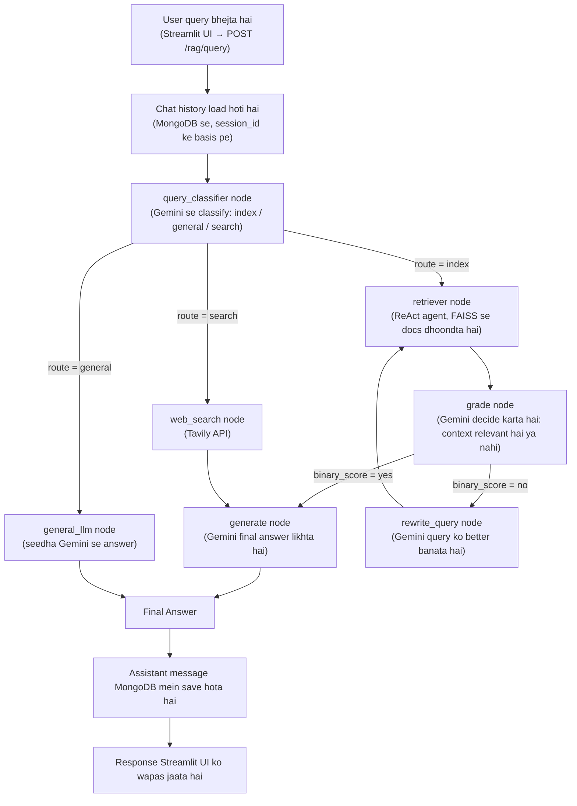
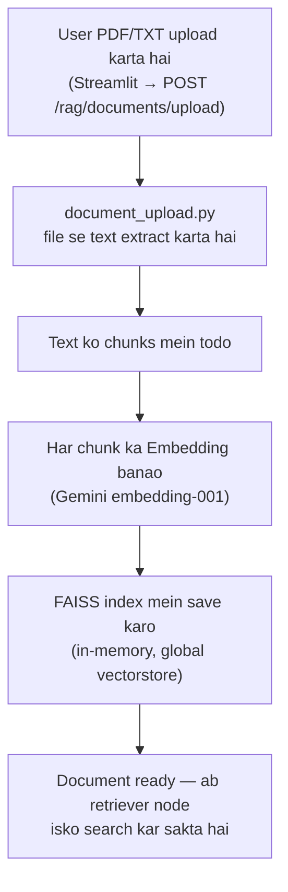
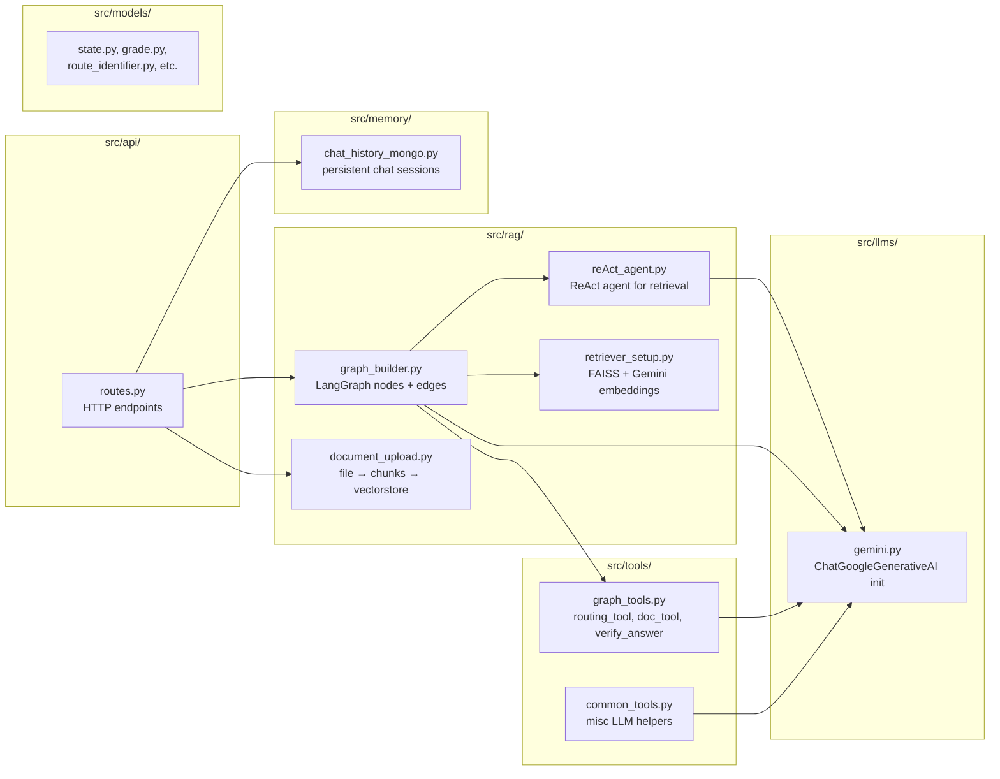

# 🔄 IntelliQuery — Architecture aur Flow (Explained)

> Ye document batata hai ki IntelliQuery kaise design kiya gaya hai, kaunsa LLM/embedding
> stack use hota hai, aur poore system ka flow (query aane se lekar answer jaane tak)
> diagram ke saath samjhata hai.

---

## 1. Ek Line Mein: Yeh Project Hai Kya?

IntelliQuery ek **agentic RAG system** hai jo **Google Gemini** ko apne LLM aur embedding
backbone ki tarah use karta hai. Ye **Adaptive RAG** pattern implement karta hai — har
query ko uske type ke hisaab se adaptively route karta hai (kabhi tumhare uploaded
documents se answer deta hai, kabhi LLM ki general knowledge se, aur kabhi real-time web
search se), instead of hamesha ek hi fixed retrieval path use karne ke. Poora orchestration
**LangGraph** ke through ek state machine (graph) ki tarah chalta hai.

> **Concept:** Adaptive RAG — query classification + conditional routing + relevance
> grading + self-correcting retrieval loop (query rewrite → re-retrieve agar context
> relevant na ho).

---

## 2. LLM aur Embedding Stackhttps://builder.aws.com/community/@ashu1osh

| Component | Technology | Kaam |
|---|---|---|
| Chat LLM | **Google Gemini** (`gemini-2.5-flash`, `ChatGoogleGenerativeAI` ke through) | Query classification, relevance grading, query rewriting, answer generation, aur ReAct retrieval agent — sab isi ek `llm` object ko use karte hain |
| Embeddings | **Google Gemini Embeddings** (`gemini-embedding-001`, `GoogleGenerativeAIEmbeddings` ke through) | Document chunks ko vectors mein convert karta hai similarity search ke liye |
| Vector Store | **FAISS** | Uploaded documents ke liye in-memory similarity search index |
| Web Search | **Tavily API** | Un queries ke liye jinhe current/real-time information chahiye |
| Chat Memory | **MongoDB** | Session-wise chat history persist karta hai |

LLM aur embeddings dono sirf ek-ek jagah initialize hote hain:
- `src/llms/gemini.py` — chat LLM initialize karta hai, sab jagah `llm` naam se import hota hai
- `src/rag/retriever_setup.py` — embeddings initialize karta hai aur FAISS retriever banata hai

### `.env` configuration

```env
GEMINI_API_KEY=your_gemini_api_key_here
GEMINI_CHAT_MODEL=gemini-2.5-flash   # optional, default already yahi hai
TAVILY_API_KEY=your_tavily_api_key_here
```

Gemini API key yahan se milti hai: https://aistudio.google.com/apikey

---

## 3. High-Level Flow Diagram (Query → Answer)



**Sabse important cheez:** Gemini **5 alag jagah** call hota hai is graph mein —
classify, grade, rewrite, generate, aur general_llm — har ek apna specific kaam karta hai.

---

## 4. Document Upload Flow (RAG ka "R" yahi hai)



Baad mein jab koi query "index" route pe jaati hai, to ReAct agent isi FAISS index mein
similarity search karta hai apne `retriever_customer_uploaded_documents` tool se.

---

## 5. Folder → Responsibility Map



| Folder/File | Iska Kaam |
|---|---|
| `src/api/routes.py` | HTTP layer — query request receive karta hai, graph invoke karta hai, response deta hai |
| `src/rag/graph_builder.py` | **Brain** — LangGraph ke saare nodes (classify, retriever, grade, rewrite, generate, web_search, general_llm) yahan defined hain |
| `src/rag/reAct_agent.py` | ReAct pattern agent — retriever tool ko reasoning ke saath call karta hai |
| `src/rag/retriever_setup.py` | FAISS vectorstore setup, Gemini embeddings, retriever tool banata hai |
| `src/rag/document_upload.py` | Uploaded file se text nikaal ke chunks + vectorstore mein daalta hai |
| `src/tools/graph_tools.py` | Conditional routing logic (`routing_tool`, `doc_tool`) aur answer verification |
| `src/tools/common_tools.py` | Misc LLM-based helper functions |
| `src/llms/gemini.py` | **Yahi hai vo jagah jahan Gemini initialize hota hai** — sab jagah se yahi `llm` import hota hai |
| `src/memory/chat_history_mongo.py` | MongoDB mein session-wise chat history persist karta hai |
| `src/models/*.py` | Pydantic schemas — `State`, `Grade`, `RouteIdentifier`, `VerificationResult` |
| `src/config/prompts.yaml` | Saare prompts (classify, grading, rewrite, generate, verify) ek jagah defined |

---


